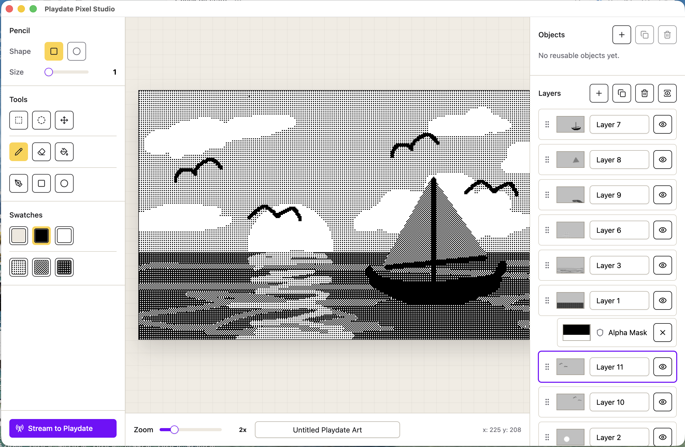

# Playdate Pixel Studio

Playdate Pixel Studio is a local-first pixel art editor for creating 1-bit artwork for Panic's Playdate. It is built as an Electron desktop app with a Vite/React renderer and TypeScript domain modules for pixel operations, layers, commands, persistence, export, and Playdate preview streaming.



## Features

- 1-bit Playdate-oriented drawing surface with black, white, and transparent pixel data.
- Layered editing with undo/redo command history.
- Object definitions and linked object instance layers for reusable artwork.
- Clipboard, selection, mask, brush, fill, shape, and pixel geometry domain operations.
- IndexedDB project persistence through Dexie.
- Playdate-sized rendering/export paths for 400 x 240 artwork.
- Experimental physical preview streaming to a Playdate companion app over LAN TCP.

## Stack

- Vite 8, React 19, TypeScript, and Electron 42.
- Zustand for editor state.
- Canvas 2D for editor and preview rendering.
- Radix/shadcn-style UI primitives with Tailwind CSS.
- Dexie/IndexedDB for local project storage.
- Vitest, ESLint, and Prettier for tests and code quality.

See [ARCHITECTURE.md](./ARCHITECTURE.md) for a deeper map of the module boundaries.

## Getting Started

Install dependencies:

```sh
npm install
```

Run the Electron app in development:

```sh
npm run dev
```

This starts the Vite renderer on `127.0.0.1:5173`, builds the Electron entrypoints, and launches Electron against the local renderer.

## Common Scripts

```sh
npm run dev            # Start Vite and Electron for local development
npm run vite:dev       # Start only the Vite renderer
npm run build          # Typecheck, build renderer, and build Electron files
npm run electron:start # Build and launch Electron
npm run electron:pack  # Build a macOS unpacked app
npm run electron:dist  # Build a macOS distributable
npm run test           # Run Vitest once
npm run test:watch     # Run Vitest in watch mode
npm run lint           # Run ESLint
npm run format:check   # Check Prettier formatting
npm run typecheck      # Typecheck app and Electron projects
```

## Project Layout

```text
src/domain       Framework-free editor model, pixel operations, layers, commands, masks
src/rendering    Canvas-independent compositing and preview rendering helpers
src/state        Zustand editor store and command orchestration
src/persistence  Project schema, serialization, and local IndexedDB storage
src/export       Playdate-oriented export helpers
src/companion    Frame packing, protocol helpers, and Electron stream client
src/components   React app shell, panels, editor canvas, and UI composition
src/hooks        Canvas input, autosave, streaming, and editor interaction hooks
electron         Electron main/preload code
companion        Playdate preview app and local stream server
docs             Design notes and project-specific documentation
```

## Playdate Companion Preview

The physical preview path is experimental. Electron packs the visible layer stack into a fixed 1-bit Playdate frame and streams the newest packet to companion apps over LAN TCP. The companion app source and built `.pdx` bundle live under `companion/playdate-preview`, and the stream service lives under `companion/stream`.

The packaged Electron build includes:

```text
companion/playdate-preview/playdate-pixel-preview.pdx
```

## Documentation

- [Architecture](./ARCHITECTURE.md)
- [UI component policy](./docs/ui-components.md)

## Notes

- `dist`, `dist-electron`, and `release` are build outputs.
- `node_modules` is dependency output and should be recreated with `npm install`.
- The app is private and currently versioned as `0.1.0`.
